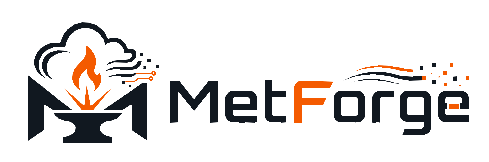

<h1 align="left">MetForge — Atmospheric Science Skills</h1>

<p align="center">
  
</p>

<p align="center">
  <a href="https://github.com/yuanruichen/MetForge/releases/latest"></a>
  <a href="https://opensource.org/license/mit"></a>
  <a href="https://skills.sh/yuanruichen/metforge"></a>
  
  
  
</p>

<p align="center">
  English · <a href="README_ZH.md">简体中文</a>
</p>

MetForge is a small collection of reusable skills for atmospheric-science work. It adds domain judgment for acquiring data, scientific calculations, figure design, and atmospheric-model diagnosis while leaving general planning, coding, tool use, and context management to the host agent. The same `skills/` source works across Codex, Claude Code, and Hermes.

## Quick Start

After installation, describe the scientific task naturally or name a skill explicitly. Codex uses `$metforge-data`, Claude Code uses `/metforge:metforge-data`, and Hermes uses `/metforge-data`; natural-language activation also works. These prompts can be copied directly:

| Scenario | Prompt |
|---|---|
| Download reanalysis data | `Use $metforge-data to download ERA5 hourly u and v at 850 hPa for 10°S–10°N, 80°E–180°E during DJFM 2000–2020. Validate one month before scaling up.` |
| Inspect and prepare local data | `Use $metforge-data to inspect these NetCDF files, verify coordinates, units, calendar, and missing values, then design a memory-safe xarray preprocessing script.` |
| Calculate an atmospheric index | `Use $metforge-analysis to calculate this SPCZ intensity and orientation index. State the exact domain, weighting, baseline, units, and validation before running it.` |
| Trend, filtering, and statistics | `Use $metforge-analysis to detrend and 20–100-day filter this continuous daily field, then calculate EOFs, regression maps, and lag composites with serial-dependence-aware uncertainty.` |
| Design an atmospheric figure | `Use $metforge-figure to turn these MJO composite fields into a clear longitude–time figure with consistent scales, units, and propagation guides.` |
| Audit an existing figure | `Use $metforge-figure to audit this multi-panel map for scientific comparability, color normalization, labels, projection artifacts, and export quality.` |
| Diagnose a dynamical-core test | `Use $metforge-model-diagnose to determine why RMS error grows in this balanced-flow test and propose the smallest experiment that separates spatial imbalance from a growing computational mode.` |
| Combine analysis and visualization | `Use $metforge-analysis to calculate the diagnostic fields and statistics, then use $metforge-figure only for the panels needed to support the conclusion.` |

## Skills

| Skill | Use it for | Example |
|---|---|---|
| [`metforge-data`](skills/metforge-data/SKILL.md) | Find, download, subset, validate, and document atmospheric datasets | “Use `$metforge-data` to download ERA5 hourly winds for this domain.” |
| [`metforge-analysis`](skills/metforge-analysis/SKILL.md) | Calculate indices, meteorological diagnostics, trends, filters, EOFs, regression, and composites | “Use `$metforge-analysis` to calculate this circulation index and its trend.” |
| [`metforge-figure`](skills/metforge-figure/SKILL.md) | Design, create, revise, and audit atmospheric-science figures | “Use `$metforge-figure` to turn these balance-test outputs into a publication-ready comparison.” |
| [`metforge-model-diagnose`](skills/metforge-model-diagnose/SKILL.md) | Diagnose dynamical-core tests, numerical experiments, balance, conservation, convergence, and error growth | “Use `$metforge-model-diagnose` to determine why the balanced-flow experiment drifts.” |

Each directory under `skills/` is an independent installable unit. The skills may cooperate, but none requires a central orchestrator.

## Install

### Codex

Clone the repository and sync all skills:

```bash
git clone https://github.com/yuanruichen/MetForge.git
cd MetForge
scripts/install-codex-skills.sh
```

Verify an existing installation without changing it:

```bash
scripts/install-codex-skills.sh --check
```

By default the installer uses `${CODEX_HOME:-$HOME/.codex}/skills`. Use `--dest PATH` to install elsewhere.

### Claude Code

Register this repository as a marketplace, then install the MetForge plugin:

```text
/plugin marketplace add yuanruichen/MetForge
/plugin install metforge@metforge
```

Claude Code discovers all four skills from the shared `skills/` directory. They are available as `/metforge:metforge-data`, `/metforge:metforge-analysis`, `/metforge:metforge-figure`, and `/metforge:metforge-model-diagnose`.

### Hermes

Add MetForge as a public Skills Hub tap:

```bash
hermes skills tap add yuanruichen/MetForge
```

Install the skills directly from GitHub:

```bash
hermes skills install yuanruichen/MetForge/skills/metforge-data
hermes skills install yuanruichen/MetForge/skills/metforge-analysis
hermes skills install yuanruichen/MetForge/skills/metforge-figure
hermes skills install yuanruichen/MetForge/skills/metforge-model-diagnose
```

Hermes treats third-party taps as community sources and security-scans skills during installation.

## Design principles

- Domain judgment over agent orchestration.
- A small, testable result before a costly run.
- Explicit scientific contracts: variables, units, coordinates, hypotheses, metrics, and evidence.
- Choose direct execution or Slurm from the actual runtime, data volume, and cost instead of assuming one environment.
- Append a processing record after every completed download, calculation, model run, or render stage.
- Raw inputs remain immutable; derived products remain reproducible.
- Figures are scientific arguments and are inspected after export.
- Claims are separated into evidence, interpretation, and unresolved uncertainty.

Codex, Claude Code, and Hermes share the same skill directories; platform-specific files contain distribution metadata only.
