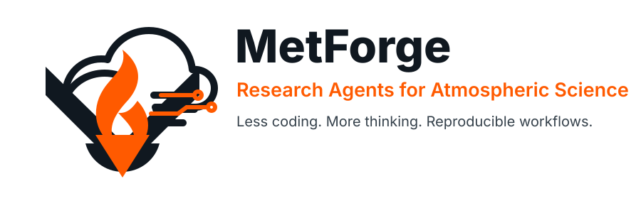

<p align="center">
  
</p>

<h1 align="center">MetForge -- Research Agents for Atmospheric Science</h1>

<p align="center">
  
</p>

<p align="center">
  
  
</p>

MetForge is a lightweight AI-agent workflow kit for atmospheric science. It helps researchers do **less coding and more thinking** by giving agents reusable instructions, atmospheric workflow skills, and clean folder conventions while scientists keep responsibility for questions, assumptions, interpretation, and evidence.

## Install

Install Codex CLI with npm, enter your MetForge project directory, and start Codex:

```bash
npm install -g @openai/codex
cd /path/to/MetForge
codex
```

## Quick Start

```text
Read AGENTS.md first. Use this repository as a scientific workflow workspace.
Keep all paths repo-relative, write data outputs to data/processed/, figures to
output/figures/, logs to output/logs/, and define a small verification check
before coding.
```

## Highlight

- `data-process`: xarray/dask and NetCDF-style processing with repo-local paths, memory-aware reductions, preserved raw inputs, and reproducible derived outputs.
- `plot` + `figure-audit`: atmospheric maps, sections, profiles, Hovmoller-style diagnostics, labeled variables/units, explicit DPI, and figure-readiness review.
- `writing`: concise scientific reports, figure captions, interpretation notes, and open research questions grounded in diagnostics.
- `lit-review`: source-grounded literature synthesis that separates source claims from interpretation and identifies useful gaps.
- `auditor`: code supervision for bugs, unsafe paths, data-loss risk, missing checks, reproducibility gaps, and overcomplication.

## Layout

```text
.
├── AGENTS.md
├── .codex/
│   ├── agents/
│   └── skills/
├── code/
│   ├── scripts/
│   ├── src/
│   └── tests/
├── configs/
├── data/
│   ├── raw/
│   └── processed/
├── docs/
│   ├── assets/
│   └── templates/
└── output/
    ├── figures/
    ├── logs/
    └── tmp/
```

### What Is Included

- `AGENTS.md`: simple operating rules for AI-agent-assisted atmospheric science workflows.
- `.codex/agents/`: specialist agent definitions, including `auditor` for code review.
- `.codex/skills/`: reusable task guidance for data processing, plotting, figure audit, writing, literature review, and coding discipline.
- `code/`: placeholders for generated scripts, notebooks, reusable source code, and tests.
- `configs/`: optional configuration files.
- `data/`: local data placeholders, ignored by git except `.gitkeep` files.
- `docs/assets/`: README images and public visual assets.
- `docs/templates/`: generic documentation templates.
- `output/`: generated figures, logs, and temporary files, ignored by git.
- `LICENSE`: MIT license.
